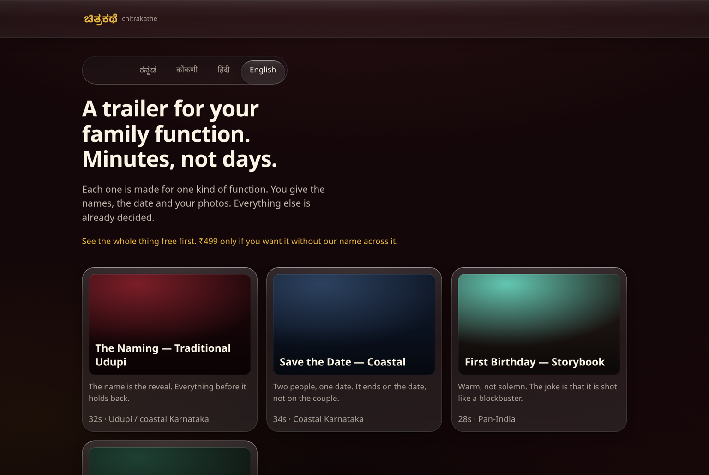
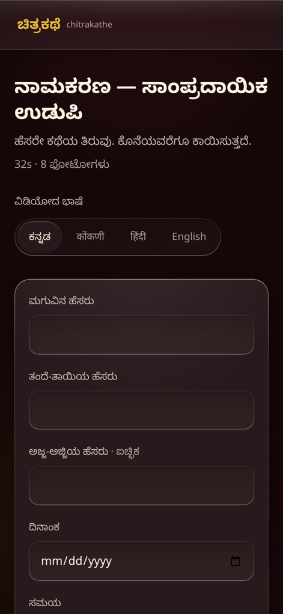
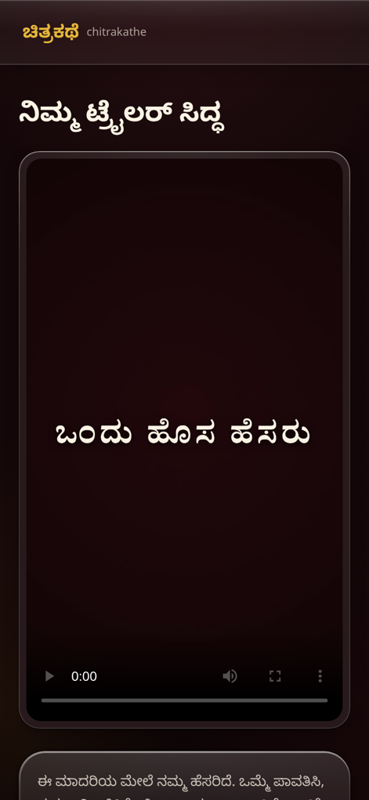
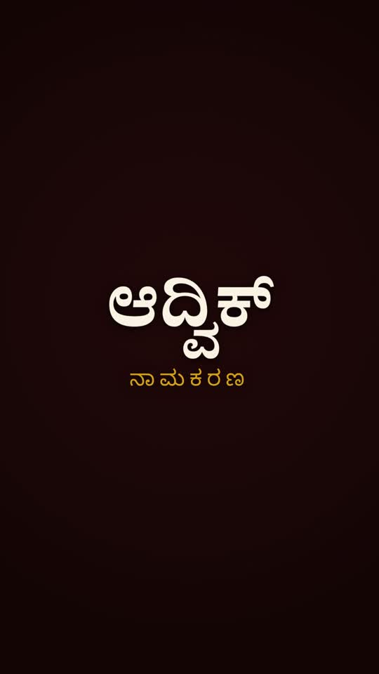
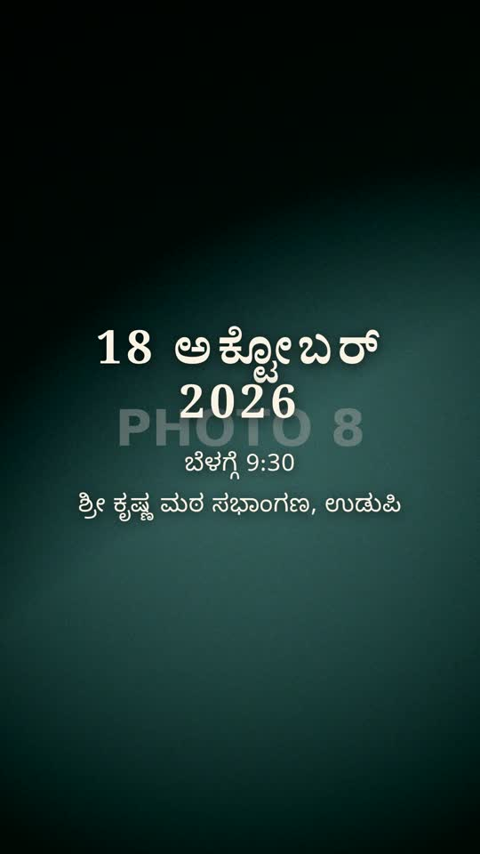
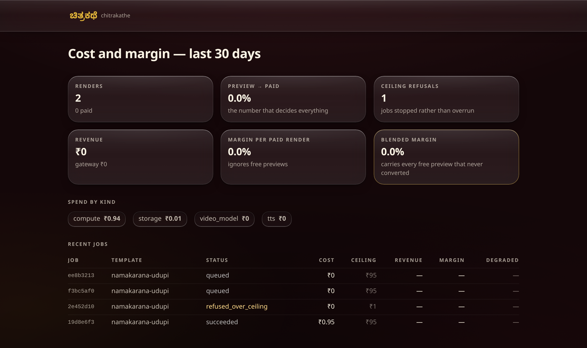
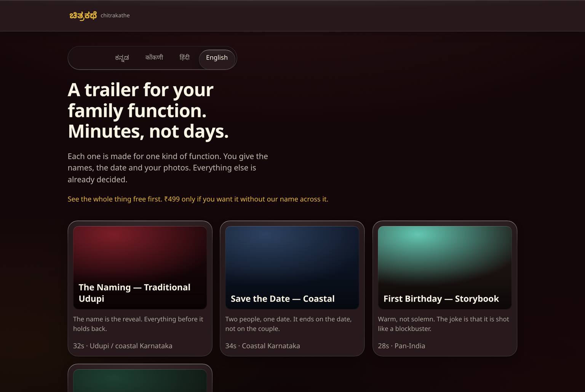
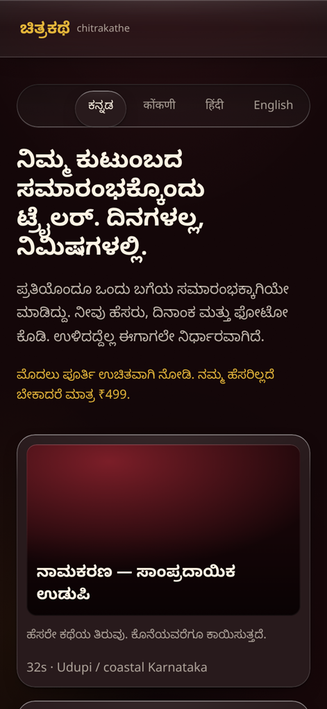

<div align="center">

# ಚಿತ್ರಕಥೆ &nbsp;Chitrakathe

### A cinematic trailer for your family function. Minutes, not days.

Eight photos and a six-field form become a 30-second movie-trailer for an Indian family
function — a baby naming, a save-the-date, a first birthday, a housewarming.
**Kannada, Konkani, Hindi, English.** Watermarked preview free, **₹499** to download it clean.



</div>

---

## What makes it different

Human studios charge **₹5,000–15,000** and take **3–7 days**. Generic AI tools make
one-size-fits-all invitation videos from a prompt. Neither serves *one family, one event,
next Saturday*.

**This is template-first, not prompt-first.** A family cannot write a good prompt, and asking
them to is why generic tools produce mediocre invitations. Instead they pick
*"namakarana trailer, traditional Udupi"* and fill in six fields. The template already owns the
shot list, the timing, the typography, the motion and the music.

The video model is a replaceable backend. Most shots are the family's own photos under
scripted camera motion; only **one or two shots per trailer** ever reach a generative model.

<table>
<tr>
<td width="50%" valign="top">

**The form asks for the photo each shot needs**

Not "upload 8 photos". The storyboard consumes photos by index with fixed meaning — photo 1
gets a centre-weighted push-in on a face, photo 8 sits under the date text. So the form asks
for *"a close photo of the baby's face"* and *"a wide, uncluttered photo — the date goes over
this one"*.



</td>
<td width="50%" valign="top">

**Watch the whole thing before you pay**

The preview is the real render, watermarked. Payment unlocks a file that already exists — it
never triggers a second render. Nobody buys unseen.



</td>
</tr>
</table>

### What comes out

Frames from a real render — `namakarana-udupi`, Kannada, produced by the pipeline in this repo.

<div align="center">

&nbsp;&nbsp;

</div>

Kannada and Devanagari conjuncts need a real shaping engine, so title cards are rendered in
headless Chromium and composited by ffmpeg. `drawtext` renders them broken or as tofu — this
is correctness, not polish.

---

## Gross margin at the launch price

**₹499** per event: unwatermarked download, both aspect ratios, one free re-render.

| Line | Basis | Cost |
|---|---|---|
| Generative shots | 2 × 5s, Seedance 720p i2v via fal @ ~$0.26/clip | ₹46.30 |
| Voiceover (TTS) | ~250 chars, Sarvam @ ₹30 / 10k chars | ₹0.75 |
| Image moderation | 10 images | ₹1.00 |
| Worker compute | ~2 min CPU | ₹2.00 |
| Storage + CDN | ~70 MB for the retention window, R2 | ₹1.00 |
| **Direct render cost** | | **₹51.05** |
| Payment gateway | Razorpay 2% + 18% GST | ₹11.78 |
| **Total on a paid job** | | **₹62.83** |

> ### **87.4% gross margin per paid render**
> ### **68.4% blended**, carrying every free preview that never converts

The two differ because **the free preview is a full render**, costing ₹51.05 whether or not
they buy. At an assumed 35% preview→paid conversion:

```
blended cost per paying family = 51.05 / 0.35 + 11.78 = ₹157.63
blended margin                 = (499 − 157.63) / 499 = 68.4%
```

**Conversion, not model price, decides whether this business works.** At 20% the blended margin
falls to 46%; at 50% it rises to 76%. The dashboard plots the real number.

<div align="center">

</div>

Three things protect that margin, all enforced in code:

1. **The master is rendered once.** Payment unlocks an existing file.
2. **Each generative shot is generated once per job**, at 9:16, and every export is a crop of it.
   `scripts/check-cost-once.ts` fails the build if that regresses — it has regressed before, and
   it made the number above wrong.
3. **A hard ceiling of ₹95 per job.** Every priced call is quoted against a ledger *before* it
   runs. A shot that cannot be afforded degrades to its authored photo fallback; a job that
   cannot fit is refused and the family is not charged.

---

## Running it

**Needs:** Node 22+, PostgreSQL 16+, ffmpeg, Chromium, and Noto fonts for Kannada and Devanagari.

```bash
sudo apt-get install -y ffmpeg fonts-noto-core
npm install
cp .env.example .env          # defaults run fully offline, no API keys
createdb chitrakathe && npm run migrate
npm test
```

### One template, end to end, with no network

```bash
npx tsx scripts/make-fixtures.ts                          # placeholder photos + music
npm run render:brief -- fixtures/brief.namakarana.json
```

Writes a playable 1080×1920 MP4 with real Kannada typography, plus the watermarked preview, and
prints the cost ledger. No database, no queue, no API keys — this is the check that the
storyboard, the type shaping, the compositor and the ledger all work before anything is built
on top of them.

### The whole thing

```bash
npm run dev        # web tier: enqueues and reads, never renders
npm run worker     # render worker, its own process
npm run costs      # cost and margin report
npm run retention  # daily: purge photos past 30 days, outputs past 90
```

### Checks

```bash
npm run typecheck
npm test                                # 28 tests: ceiling, no-likeness, session cookie, uuid guard, Indic dates
npx tsx scripts/check-languages.ts      # 4 templates × 4 languages → two contact sheets
npx tsx scripts/check-cost-once.ts      # the model is called once per shot, not once per aspect
```

---

## How it is built

```
Next.js (App Router)  ──▶  Postgres  ◀──  render worker (own process)
      │                       │                    │
      │ presigned PUT         │ pg-boss queue      ├── VideoProvider  (fal ▸ replicate ▸ stub)
      ▼                       │                    ├── TtsProvider    (sarvam ▸ elevenlabs ▸ stub)
 Object storage  ◀────────────┴────────────────────┤── Moderation     (sightengine ▸ stub)
 (S3-compatible)                                   └── Compositor     (Chromium cards + ffmpeg)
```

- **Nothing renders in a web request.** The web tier writes a row and a queue message.
- **pg-boss on the same Postgres.** No Redis; job state is transactional with domain state.
- **Templates are JSON, validated at boot.** A malformed or over-budget template fails the
  process at startup, not at render time with a family waiting.
- **Sign-in gates the render, not the door.** A family browses, fills the brief, uploads photos
  and watches the watermarked preview with no account. The render is the only irreversible
  spend, so that is where Google sign-in sits. Watching a trailer stays public — the growth
  loop is a WhatsApp forward. See [docs/auth.md](docs/auth.md).

### The interface

Apple-style liquid glass, dark and cinematic, specified in
[docs/design-spec.md](docs/design-spec.md). Glass is a *sampling* material, so a template-tinted
scene layer sits behind everything; without it `backdrop-filter` renders as grey plastic.

Most of this product's traffic is mid-range Android, where `backdrop-filter` takes a slow
readback path. Three independent gates drop to opaque fills with **identical geometry, radii,
rim and shadows** — and the flat fill is never lighter than the glass it replaces, so contrast
only improves.

<table>
<tr>
<td align="center"><b>Glass</b><br></td>
<td align="center"><b>Opaque fallback</b><br></td>
</tr>
</table>

**Indic is a token, not a convention.** Every type style reads `var(--tracking)` and nothing
sets `letter-spacing` literally, so `:lang(kn|hi|kok)` zeroes it in one place — tracking splits
ನಾಮಕರಣ into ನಾ ಮ ಕ ರ ಣ. Buttons and fields use `min-height`, never `height`, because Kannada
line boxes are taller.

<div align="center">

</div>

### No likeness generation

The generated shots are **objects and environments** — a cradle, a lamp, the sea, a kalash.
Never a face. Enforced three ways: `GenerativeShot.subject` has no `"person"` member, the
template schema rejects any prompt that names a human subject or omits its explicit exclusion,
and a test asserts both across all four templates.

### Privacy

Uploaded photos are hard-deleted after **30 days**, rendered videos kept **90**. EXIF including
GPS is stripped on ingest. Every upload passes a moderation gate before a job can be queued.
`npm run retention` is what makes those statements true — schedule it daily.

---

## Layout

```
prd.md                      product spec, competitive study, open decisions
docs/design-spec.md         the interface, in exact values
docs/auth.md                why sign-in sits at the render
docs/known-gaps.md          what is deliberately unfinished, and what it needs
src/lib/templates/          the storyboards (JSON) + the schema that validates them
src/lib/render/             ffmpeg, Chromium title cards, motion, the pipeline
src/lib/cost/               price table, ledger, ceiling, margin reporting
worker/index.ts             the render worker
```

## Before launch

The merchant name, address and phone in `src/lib/legal.ts` are **literal blanks**, and the music
beds are **synthesised placeholders**. Neither is filled with something plausible-looking on
purpose — an invented address on a refund policy is worse than an obvious gap. Full list in
[docs/known-gaps.md](docs/known-gaps.md).
